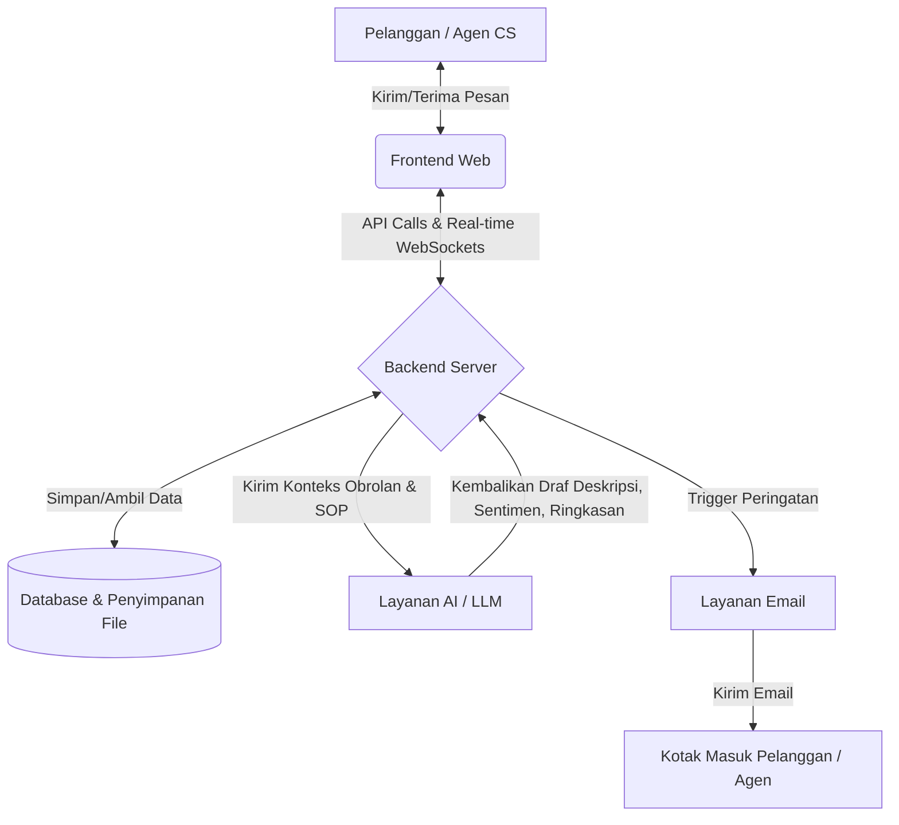
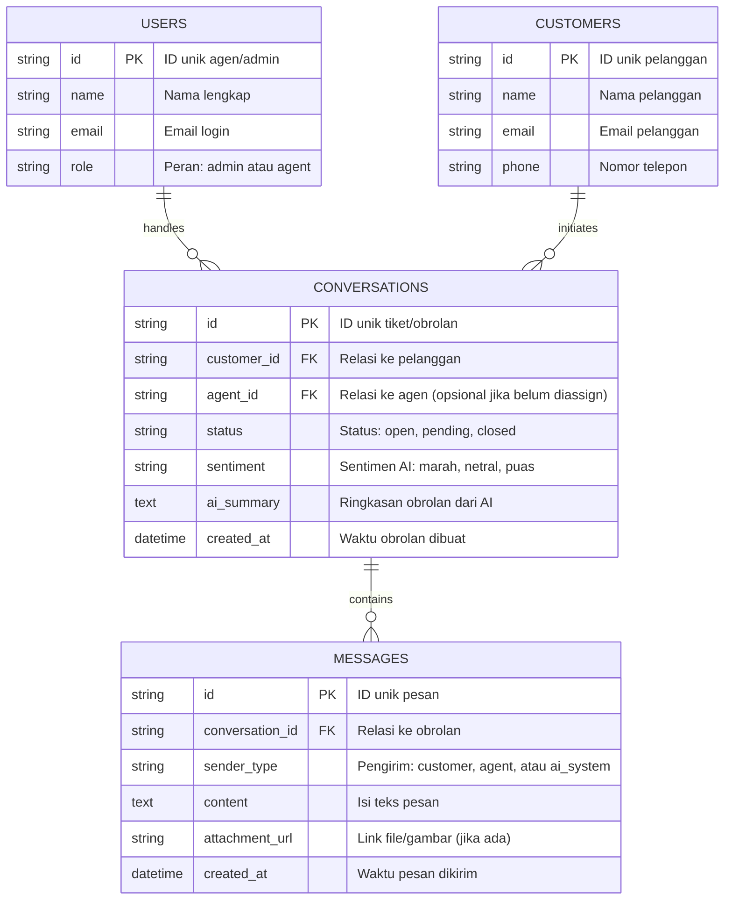

# PRD — Project Requirements Document

## 1. Overview
**AI Customer Support Inbox** adalah platform manajemen pesan pelanggan cerdas yang dirancang khusus untuk Agen *Customer Service* (CS). Masalah yang sering dihadapi oleh agen CS adalah kewalahan saat harus membaca riwayat obrolan yang panjang, kehilangan konteks pelanggan, dan lambat dalam menyusun balasan yang sesuai dengan SOP perusahaan. 

Aplikasi ini hadir untuk memberikan solusi *human-in-the-loop* AI, di mana agen manusia bekerja berdampingan dengan kecerdasan buatan. Dengan aplikasi ini, agen dapat memberikan jawaban yang lebih cepat dan akurat. Nilai utama dari platform ini adalah menghemat waktu agen secara drastis (meningkatkan efisiensi kerja) sekaligus memberikan pengalaman yang lebih responsif bagi pelanggan.

## 2. Requirements
*   **Aksesibilitas & Keamanan:** Sistem harus memiliki pembagian peran (*role-based access*) yang jelas antara agen CS dan Administrator.
*   **Sistem Waktu Nyata (*Real-time*):** Pesan yang masuk dan keluar harus diperbarui secara *real-time* tanpa perlu memuat ulang halaman.
*   **Integrasi AI Terpusat:** Sistem AI harus mampu mengakses dan memproses dokumen/SOP internal perusahaan secara aman untuk menghasilkan draf ringkasan dan balasan (menggunakan metode RAG).
*   **Sentralisasi Data:** Seluruh saluran komunikasi pelanggan harus bermuara pada satu antarmuka dasbor tunggal yang mudah digunakan.
*   **Kinerja & Notifikasi:** Sistem harus tanggap dalam mengirimkan peringatan otomatis untuk pesan tertunda atau tiket dengan prioritas tinggi.

## 3. Core Features
*   **Login & Authentication:** Sistem masuk yang aman untuk agen dan administrator guna melindungi data pelanggan.
*   **Customer List & Message History:** Menampilkan profil lengkap pelanggan beserta seluruh riwayat obrolan masa lalu. Ini memberikan kemenangan pertama (*first win*) bagi agen karena mereka dapat langsung memahami konteks pelanggan.
*   **Conversation Inbox & Attachment Upload:** Dasbor interaktif tempat agen menerima dan membalas pesan. Mendukung pengiriman teks, gambar, dan dokumen.
*   **AI Reply Draft (RAG):** *Fitur Unggulan.* AI secara sadar membaca SOP internal dan membuatkan draf balasan yang akurat, sehingga agen bisa merespons jauh lebih cepat.
*   **AI Sentiment Analysis & Auto-Tagging:** AI mendeteksi apakah pelanggan sedang marah atau puas. Sistem secara otomatis memberi label dan memprioritaskan antrean tiket untuk pelanggan yang tidak puas (membutuhkan penanganan cepat).
*   **AI Conversation Summarizer:** *Fitur Unggulan.* Hanya dengan satu klik, AI membuat ringkasan dari obrolan pelanggan yang sudah terlalu panjang, sangat menghemat waktu agen dalam membaca riwayat keluhan.
*   **Email Notification:** Sistem pemberitahuan pemicu otomatis. Agen mendapat peringatan via email untuk tiket darurat, dan pelanggan mendapat email saat agen telah membalas pesannya.

## 4. User Flow
1. **Masuk ke Dasbor:** Agen CS *login* ke dalam sistem.
2. **Prioritas Tugas:** Agen melihat daftar antrean pesan. Pesan dengan label "Marah/Darurat" (hasil analisis sentimen AI) berada di posisi teratas.
3. **Mendapatkan Konteks (First Win):** Agen mengklik pesan tersebut. Di sebelah kanan, agen dapat melihat profil pelanggan dan riwayat pesan masa lalu. 
4. **Membaca Ringkasan:** Karena riwayat keluhan sangat panjang, agen menekan tombol **"Ringkas Obrolan"**. AI langsung memberikan 3 poin utama masalah pelanggan.
5. **Membuat Balasan Cepat:** Agen menekan tombol **"AI Draft"**. AI membaca SOP perusahaan dan menyiapkan teks balasan.
6. **Validasi Manusia (*Human-in-the-loop*):** Agen membaca draf tersebut, melakukan sedikit penyesuaian agar lebih personal, lalu menekan "Kirim". 
7. **Notifikasi:** Pelanggan menerima balasan dan notifikasi email bahwa keluhannya telah ditanggapi. Waktu agen pun menjadi jauh lebih hemat.

## 5. Architecture
Sistem ini menggunakan arsitektur aplikasi berbasis *web* modern yang mengelola komunikasi klien dan layanan pihak ketiga (AI dan Email) melalui Backend terpusat.

## 6. Database Schema
Berikut adalah struktur inti dari basis data yang digunakan untuk menyimpan entitas kunci pada layanan *Inbox CS AI*.

## 7. Tech Stack
Untuk membangun aplikasi ini dengan cepat, efisien, dan modern, berikut rekomendasi teknologi yang disarankan:

*   **Framework:** Next.js
*   **Backend & Deployment:** InsForge (Mengelola server, database, dan hosting secara otomatis).
*   **Authentication:** InsForge Auth.
*   **Email Service:** InsForge SMTP.
*   **Desain & UI:** Tailwind CSS dan shadcn/ui.
*   **AI Integration:** OpenRouter API.